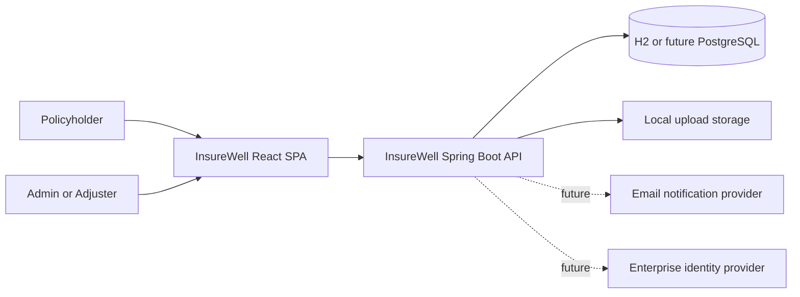
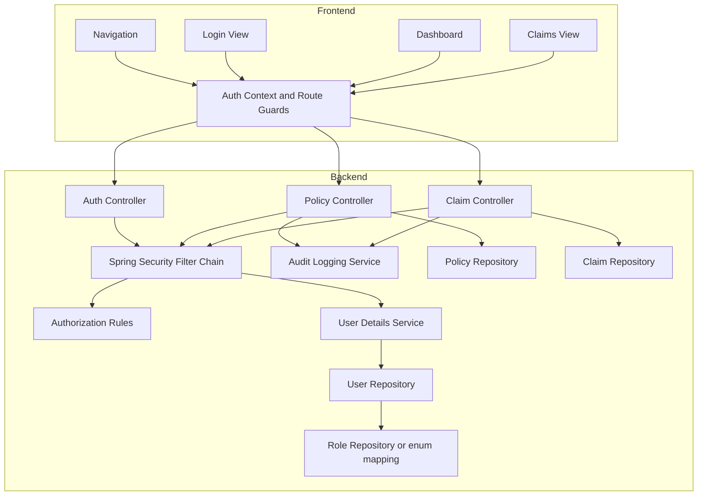
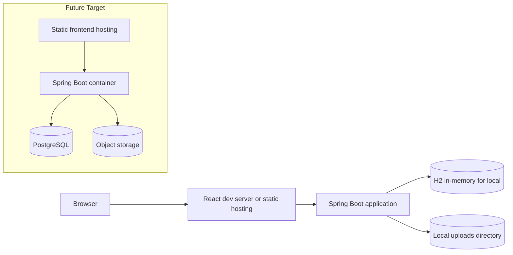
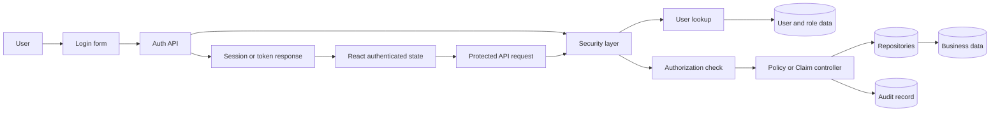
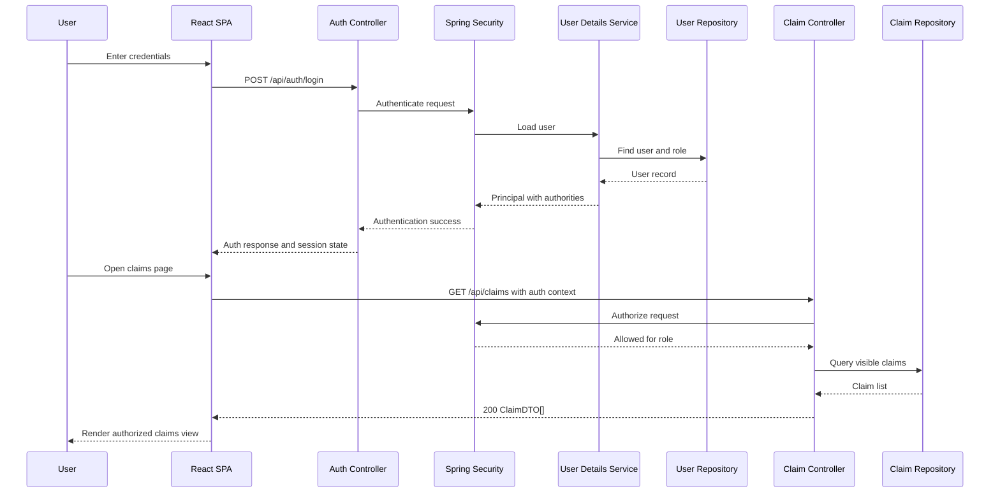

# InsureWell Architecture

## 1. Purpose
This document translates the approved business requirements and HLD into architecture decisions for the next implementation slice, with emphasis on Issue #11:
- user authentication
- role-based authorization
- protected policy and claim operations

The design preserves the current baseline:
- React frontend
- Spring Boot backend
- H2 for local development

It intentionally evolves the existing modular monolith instead of introducing a distributed rewrite.

## 2. Architecture Decisions

### Accepted
1. Keep a single React SPA plus a single Spring Boot API for the authenticated MVP.
2. Add authentication and authorization inside the existing backend boundary using Spring Security.
3. Introduce a local user store in JPA/H2 first, with a future path to external identity.
4. Use backend-enforced authorization as the source of truth, with frontend route gating as a UX layer.
5. Keep the current H2 local workflow, but isolate identity, audit, and authorization seams so the datastore can later move to PostgreSQL.

### Rejected
1. Full external IdP or SSO in the first release.
Reason: too much environment and integration complexity for the current workshop baseline.

2. Split auth into a dedicated microservice.
Reason: adds operational complexity without enough scale justification.

3. Frontend-only access control.
Reason: it does not protect the REST API and fails the core security requirement.

## 3. System Context Diagram

Intent:
- Show the system boundary, primary actors, and external dependencies for the authenticated MVP.

Key components:
- Policyholder and Admin/Adjuster personas
- React SPA
- Spring Boot API
- Local relational datastore
- Local file storage
- Future notification and identity integration points

Trade-offs:
- Local datastore and file storage keep developer setup simple.
- This choice is not production-grade for multi-node deployments.

NFR impact:
- Positive for developer productivity and workshop repeatability
- Neutral to weak for scalability and enterprise identity readiness

Risks:
- Security assumptions can leak if local-only shortcuts remain in production paths.
- Upload and identity concerns may couple too tightly unless interfaces stay explicit.

## 4. Component Diagram

Intent:
- Show the internal authenticated application structure and the new security-related components.

Key components:
- Frontend auth context and protected route logic
- Spring Security filter chain
- User details and role lookup
- Existing policy/claim controllers behind auth rules
- Audit logging as a separate service concern

Trade-offs:
- Embedding security in the current monolith reduces delivery cost.
- It raises coupling between business controllers and the security model unless authorization rules are centralized.

NFR impact:
- Strong positive effect on security and auditability
- Slight performance overhead per request due to auth checks

Risks:
- Role logic scattered across controllers can become brittle.
- Audit logging may be skipped if not enforced through shared hooks.

## 5. Deployment Diagram

Intent:
- Show the practical runtime topology for local development and near-term deployment.

Key components:
- Browser
- React frontend runtime
- Spring Boot application runtime
- Local H2 and uploads
- Future target with durable DB and object storage

Trade-offs:
- Current deployment is easy to run but intentionally non-durable.
- Future topology stays evolutionary rather than disruptive.

NFR impact:
- Good for local reliability and quick startup
- Weak for durability, horizontal scaling, and disaster recovery

Risks:
- H2 masks data migration and concurrency concerns.
- Local upload storage complicates later multi-instance rollout if not abstracted.

## 6. Data Flow Diagram

Intent:
- Show how authenticated requests and authorization decisions flow through the system.

Key components:
- Login request path
- User and role lookup path
- Protected API request path
- Audit event emission path

Trade-offs:
- Centralized backend enforcement improves correctness.
- Session or token lifecycle introduces new client state management complexity.

NFR impact:
- Improves confidentiality and traceability
- Adds modest latency to each protected request

Risks:
- Token or session storage choices can create browser-side security weaknesses.
- Authorization mistakes can expose cross-user policy or claim data.

## 7. Critical Sequence Diagram

Intent:
- Describe the core login plus protected claims access workflow needed for Issue #11.

Key components:
- Credential exchange
- User lookup and authority mapping
- Protected claims retrieval

Trade-offs:
- Straightforward sequence supports rapid implementation.
- Visibility filtering for policyholders requires careful ownership modeling beyond the current claim data shape.

NFR impact:
- Strong improvement in access control and least privilege
- Possible complexity increase in test setup and local demos

Risks:
- The current data model does not yet clearly bind claims to authenticated user identities.
- Admin and adjuster role split remains an unresolved product choice.

## 8. Migration Path from Current Baseline

1. Introduce user and role entities plus seed a default admin account in H2.
2. Add Spring Security with a dedicated auth endpoint and protected API defaults.
3. Add frontend login/logout flow and auth state management.
4. Protect policy and claim endpoints, then add role-aware navigation.
5. Add resource ownership checks for policyholder visibility.
6. Add audit logging hooks for auth and claim-sensitive mutations.
7. Replace H2 with PostgreSQL and local uploads with object storage when leaving local-only environments.

## 9. Open Decisions

1. Session cookie vs bearer token for the SPA
2. Separate adjuster role vs admin-only claims operations in the first release
3. User self-registration vs admin-provisioned users only
4. Whether policy ownership should be inferred from a policy-to-user relation or a claim-to-user projection

## 10. Cloud Delegation Candidates

1. Task: Add Architecture Decision Records for auth model and role model
   Files: docs/InsureWell_Architecture.md, docs/adr/
   Effort: S
   Risk: Low
   Acceptance criteria: ADRs capture accepted and rejected auth options with rationale.

2. Task: Add CI quality gate for security and auth tests
   Files: pipelines/backend.yml, pipelines/frontend.yml
   Effort: M
   Risk: Medium
   Acceptance criteria: pull requests fail when auth-related tests or security checks fail.

3. Task: Add observability checklist for authenticated flows
   Files: docs/InsureWell_Architecture.md, docs/ImplementationNotes.md
   Effort: S
   Risk: Low
   Acceptance criteria: request logging, auth failure logging, and audit event expectations are documented.

4. Task: Document local-to-production identity migration plan
   Files: docs/InsureWell_Architecture.md, docs/BRD.md
   Effort: S
   Risk: Low
   Acceptance criteria: architecture doc explicitly maps local JPA auth to future enterprise identity integration.

## 11. Recommended Next Agent

- 5.SDLC Dev Agent for implementation of Issue #11
- 4.SDLC Design Agent if a dedicated login screen and role-aware UX wireframes are needed before implementation