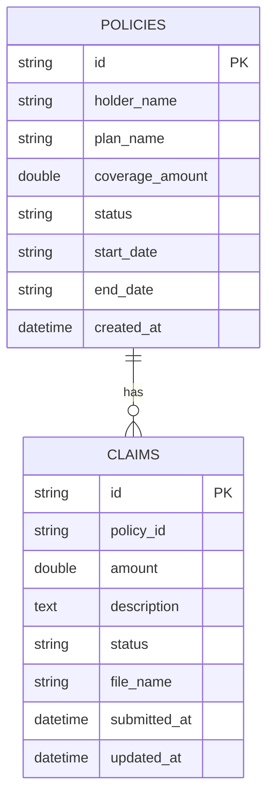

# InsureWell Data Model

## 1. Scope
This data model describes the current InsureWell persistence design and near-term evolution requirements for:
- Policy lifecycle
- Claim submission and status updates
- JPA entity and repository contracts
- Constraints and migration guidance

## 2. Storage and Persistence Context
- Runtime datastore (current): H2 in-memory database
- ORM: Spring Data JPA (Hibernate)
- Seed source: DataConfig startup data seeding

Local development persistence model is intentionally lightweight; productionization requires migration tooling and durable storage.

## 3. Entity Definitions

### 3.1 Policy (table: policies)
Purpose:
- Represents an insurance policy record.

Primary key:
- id (String)

Core attributes:
- holderName (String, not null)
- planName (String, not null)
- coverageAmount (Double, not null)
- status (String, not null; domain target: active|inactive)
- startDate (String, not null)
- endDate (String, not null)
- createdAt (LocalDateTime, not null)

Lifecycle behavior:
- createdAt populated by @PrePersist when absent.

### 3.2 Claim (table: claims)
Purpose:
- Represents an insurance claim tied to a policy.

Primary key:
- id (String)

Core attributes:
- policyId (String, not null)
- amount (Double, not null)
- description (String/TEXT, not null)
- status (String, not null; current domain: Pending|Approved|Rejected)
- fileName (String, nullable)
- submittedAt (LocalDateTime, not null)
- updatedAt (LocalDateTime, not null)

Lifecycle behavior:
- submittedAt/updatedAt initialized by @PrePersist when absent.
- updatedAt refreshed by @PreUpdate and explicit status update path.

## 4. Relationships

Logical relationship:
- Policy 1 : N Claim

Current implementation detail:
- Claim stores policyId as scalar field.
- Policy existence is validated in controller before claim creation.
- Explicit JPA object association (@ManyToOne) is not yet modeled.

Design recommendation:
- Move to explicit entity association or enforce DB-level foreign key in migration scripts.

## 5. ER Diagram

## 6. Repository Contracts

PolicyRepository:
- extends JpaRepository<Policy, String>
- findAllByOrderByCreatedAtAsc()

ClaimRepository:
- extends JpaRepository<Claim, String>
- findByPolicyIdOrderBySubmittedAtDesc(String policyId)
- findAllByOrderBySubmittedAtDesc()

These methods define current read patterns for dashboard and claims views.

## 7. Constraints and Business Rules

Current enforced rules:
- Required fields through JPA not-null annotations
- claim amount > 0 validated at API layer
- policy coverageAmount > 0 validated at API layer
- claim status restricted in API path to Pending/Approved/Rejected

Gaps to close:
- DB-level CHECK constraints for status and positive amounts
- DB-level FK from claims.policy_id to policies.id
- Consistent date format governance for startDate/endDate strings

## 8. Claims Submission and Status Update Model Notes

Claim submission model:
- id generated as CLM-{epochMillis}
- initial status set to Pending
- fileName currently null in active implementation

Claim status update model:
- endpoint accepts replacement status
- no transition graph enforcement yet (for example, Approved -> Pending is technically possible)

Design recommendation:
- Add state transition policy and event log table before introducing admin workflow automation.

## 9. Migration Notes

Current state:
- Schema derives from entities at runtime for local development.

Target migration baseline:
1. Introduce Flyway or Liquibase.
2. Add versioned DDL for:
   - foreign key constraints
   - check constraints
   - indexes on claims(policy_id, submitted_at)
3. Add repeatable seed scripts for deterministic local demos.
4. Add migration verification checks in CI.

## 10. Data Lifecycle and Retention

Current behavior:
- Deletes are hard deletes.
- Claims and policies can be removed permanently through API endpoints.

Design decisions needed:
- soft delete vs hard delete policy for compliance readiness
- retention period for claims and potential future attachments
- archival/export mechanism for audit and reporting use cases

## 11. Validation and Testing Expectations

Critical tests:
1. Claim create rejects missing or invalid policy_id.
2. Claim create rejects non-positive amount.
3. Claim status update rejects invalid status values.
4. Claim list returns deterministic submittedAt-desc ordering.
5. Policy list returns deterministic createdAt-asc ordering.

Future tests:
- migration tests for schema constraints
- referential integrity tests at DB layer
- transition-graph tests for claim workflow

## 12. Open Questions
1. Should Policy-Claim relation be modeled with @ManyToOne/@OneToMany now, or deferred until migration tooling lands?
2. Should claim attachments move from single fileName field to normalized attachment table?
3. Should claim status history be captured in a dedicated claim_events table for F3/F5/F6?
