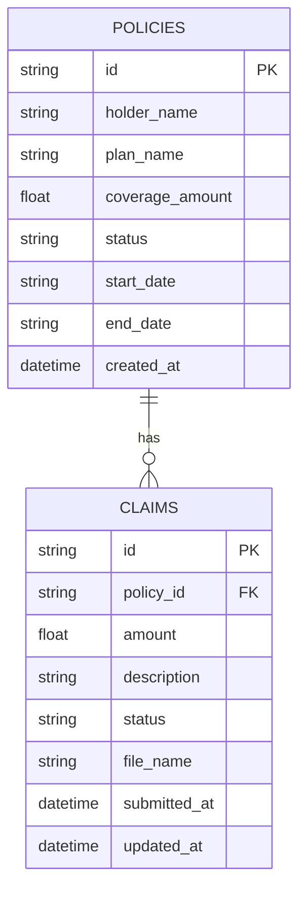

# InsureWell Data Model

## 1. Data Model Scope
This document defines the persistent entities, relationships, constraints, repository access patterns, and migration guidance for the current InsureWell backend.

## 2. Physical Storage
- Primary store: H2 in-memory database for local development and workshop execution.
- Persistence is managed by Spring Data JPA.
- Sample data is loaded by `DataConfig` at startup when the repositories are empty.

## 3. Entity Model
### 3.1 Policy
Purpose:
- Stores health insurance policy records.

Physical mapping:
- Entity class: `com.insurewell.model.Policy`
- Table: `policies`

Attributes:
| Column | Type | Nullability | Notes |
|---|---|---|---|
| id | TEXT | PK | Application-generated string id |
| holder_name | TEXT | NOT NULL | Policyholder name |
| plan_name | TEXT | NOT NULL | Coverage plan name |
| coverage_amount | REAL | NOT NULL | Numeric coverage limit |
| status | TEXT | NOT NULL | Expected values: active, inactive |
| start_date | TEXT | NOT NULL | Stored as ISO-style text |
| end_date | TEXT | NOT NULL | Stored as ISO-style text |
| created_at | TIMESTAMP/TEXT | NOT NULL | Set on create if absent |

Business rules:
- coverage_amount must be greater than 0.
- status is currently constrained by application logic to active or inactive.
- created_at is filled during persistence if not supplied.

### 3.2 Claim
Purpose:
- Stores claim submissions associated with policies.

Physical mapping:
- Entity class: `com.insurewell.model.Claim`
- Table: `claims`

Attributes:
| Column | Type | Nullability | Notes |
|---|---|---|---|
| id | TEXT | PK | Application-generated string id |
| policy_id | TEXT | NOT NULL | References `policies.id` logically |
| amount | REAL | NOT NULL | Claim amount |
| description | TEXT | NOT NULL | Claim detail text |
| status | TEXT | NOT NULL | Expected values: Pending, Approved, Rejected |
| file_name | TEXT | NULL | Optional attachment filename metadata |
| submitted_at | TIMESTAMP/TEXT | NOT NULL | Set on create if absent |
| updated_at | TIMESTAMP/TEXT | NOT NULL | Updated on every save |

Business rules:
- policy_id must reference an existing policy.
- amount must be greater than 0.
- status is application-constrained to Pending, Approved, or Rejected.
- file_name is optional and is currently metadata only.

## 4. Relationships
- Policy 1 to Claim many.
- The application stores the relationship through `claims.policy_id`.
- There is no object-level JPA association in the current model.
- No database foreign key is declared in the current code; referential integrity is enforced by repository lookups before claim creation.

## 5. Logical ER View

## 6. Data Integrity Constraints
### Current enforced constraints
- Primary key uniqueness on policy and claim ids.
- NOT NULL constraints on core required fields.
- Application-level existence check before creating a claim.

### Current app-layer validations
- Positive numeric values for coverage_amount and amount.
- Allowed policy status values: active, inactive.
- Allowed claim status values: Pending, Approved, Rejected.

### Recommended DB-level hardening
1. Add CHECK constraints for status columns.
2. Add CHECK constraints for positive numeric fields.
3. Add an index on `claims.policy_id` for filtered claim retrieval.
4. Add an index on `claims.submitted_at` for descending list queries.

## 7. Repository Access Patterns
### 7.1 PolicyRepository
- `findAllByOrderByCreatedAtAsc()` for dashboard policy ordering.
- `findById(id)` for detail fetch.
- `save(entity)` for create/update.
- `deleteById(id)` for deletion.

### 7.2 ClaimRepository
- `findAllByOrderBySubmittedAtDesc()` for full claim listing.
- `findByPolicyIdOrderBySubmittedAtDesc(policyId)` for policy-scoped filtering.
- `findById(id)` for status update and delete flows.
- `save(entity)` for create/update.
- `deleteById(id)` for deletion.

## 8. CRUD Behavior Matrix
| Entity | Create | Read | Update | Delete |
|---|---|---|---|---|
| policies | POST /api/policies | GET /api/policies, GET /api/policies/{id} | PATCH /api/policies/{id} | DELETE /api/policies/{id} |
| claims | POST /api/claims | GET /api/claims | PATCH /api/claims/{id}/status | DELETE /api/claims/{id} |

## 9. Data Lifecycle and Retention Considerations
- Policy and claim rows use hard delete semantics today.
- Attachment metadata is stored in the claim row only as file_name.
- Physical file cleanup is not implemented in the current backend.

Recommended policy decisions:
1. Define retention requirements before adding attachment storage.
2. Decide whether claim history should be soft-deleted or preserved for audit.
3. Add orphan-file cleanup if file storage is introduced.

## 10. Migration Notes
Current state:
- Schema bootstrap is derived from the JPA model and startup seed configuration.

Planned evolution:
1. Introduce versioned migrations before schema expansion.
2. Add explicit DB constraints in migration scripts.
3. Add forward-only migration guidance for non-dev environments.
4. Add lightweight post-migration data checks.

## 11. Validation and Test Expectations
Critical data-model test cases:
1. Reject claim creation when policy_id does not exist.
2. Reject negative or zero amounts.
3. Reject invalid claim status values.
4. Reject invalid policy status values.
5. Ensure policy-scoped claim retrieval is ordered by submitted_at descending.

## 12. Assumptions and Open Questions
Assumptions:
1. Single-tenant data model for the current workshop scope.
2. Timestamps are persisted as local date-time values and serialized to ISO-like strings in DTOs.
3. Data volume remains small enough for an in-memory H2 development store.

Open questions:
1. Should claim status history be modeled as a separate table?
2. Should policy and claim ids move to UUIDs for distributed safety?
3. Should claim attachments gain first-class metadata columns before production hardening?
