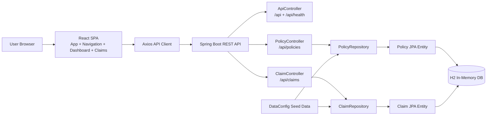

# InsureWell High-Level Design

## 1. Overview
InsureWell is a two-tier insurance servicing application built with a React frontend and a Spring Boot REST backend. The current implementation supports policy browsing and maintenance, claim submission, claim status updates, and seeded H2-backed demo data.

This HLD describes the current logical architecture and the near-term design baseline for extending the product toward role-aware claim servicing.

## 2. Scope
### In scope
- Component boundaries and responsibilities.
- React to Spring Boot request/response flow.
- JPA persistence layer and repository responsibilities.
- Claims submission and claim status update API surface.
- Validation, error handling, observability, and test strategy.

### Out of scope
- Authentication and authorization workflows.
- External integrations such as notifications, billing, or provider networks.
- Multi-service decomposition or deployment topology.

## 3. Architecture Summary
### Runtime stack
- React 18 frontend using Axios for API calls.
- Spring Boot 3.x backend running on Java 17.
- Spring Data JPA with an H2 in-memory database for local development.
- CORS enabled for local browser access and proxy-based development.

### Component diagram

## 4. Module Boundaries and Responsibilities
### 4.1 Frontend presentation module
Owned components:
- `App`
- `Navigation`
- `Dashboard`
- `Claims`

Responsibilities:
- Load policies and claims from the REST API.
- Render dashboard summaries, policy detail cards, and claim tables.
- Drive create, edit, delete, and status update interactions.
- Maintain local UI state for active page, selected policy, filters, and form dialogs.

### 4.2 API entry module
Owned controller:
- `ApiController`

Responsibilities:
- Expose `/api` and `/api/health` endpoints for basic service discovery and liveness.
- Provide a lightweight status payload for local checks.

### 4.3 Policies API module
Owned controller:
- `PolicyController`

Responsibilities:
- List, create, update, fetch, and delete policies.
- Validate policy create/update payloads before persistence.
- Return DTOs rather than JPA entities to the frontend.

### 4.4 Claims API module
Owned controller:
- `ClaimController`

Responsibilities:
- List claims globally or filtered by policy.
- Create claims against an existing policy.
- Update claim status.
- Delete claims.
- Enforce claim status values and policy existence checks.

### 4.5 Persistence module
Owned artifacts:
- `Policy`
- `Claim`
- `PolicyRepository`
- `ClaimRepository`
- `DataConfig`

Responsibilities:
- Map the logical model to JPA entities.
- Persist and retrieve policies and claims.
- Seed demo data during startup when the database is empty.

## 5. Data Flow
### 5.1 Initial page load
1. The browser loads the React SPA.
2. `App` issues parallel `GET` requests to `/api/policies` and `/api/claims`.
3. The frontend receives DTO arrays and stores them in component state.
4. `Dashboard` and `Claims` render from the shared in-memory data set.

### 5.2 Claim submission flow
1. The user opens the claims screen and selects a policy.
2. The form posts multipart form fields to `POST /api/claims`.
3. `ClaimController` validates `policy_id`, `amount`, and `description`.
4. The controller checks policy existence via `PolicyRepository`.
5. A new `Claim` entity is built with status `Pending`, timestamps, and an auto-generated id.
6. `ClaimRepository.save(...)` persists the claim to H2.
7. The backend returns the created `ClaimDTO` with HTTP 201.

### 5.3 Claim status update flow
1. The user changes the claim status from the claims table.
2. The frontend sends `PATCH /api/claims/{id}/status` with JSON body `{ "status": "Approved" }`.
3. `ClaimController` validates the target status value.
4. The controller loads the claim from `ClaimRepository`.
5. The claim status and `updatedAt` timestamp are saved.
6. The backend returns the updated `ClaimDTO` with HTTP 200.

### 5.4 Policy maintenance flow
1. The dashboard loads policy cards from `GET /api/policies`.
2. Create and edit actions send JSON payloads to the policy endpoints.
3. Policy deletion removes only the policy row; claim rows are not automatically cascaded in the current controller flow.

## 6. JPA Persistence Layer
### 6.1 Entity model
- `Policy` maps to the `policies` table.
- `Claim` maps to the `claims` table.

### 6.2 Repository model
- `PolicyRepository extends JpaRepository<Policy, String>`.
- `ClaimRepository extends JpaRepository<Claim, String>`.

Repository query methods currently used by the application:
- `findAllByOrderByCreatedAtAsc()` for policy list ordering.
- `findAllByOrderBySubmittedAtDesc()` for claim list ordering.
- `findByPolicyIdOrderBySubmittedAtDesc(policyId)` for policy-scoped claim views.

### 6.3 Persistence behavior
- IDs are application-generated strings, not database identities.
- `Policy` and `Claim` both use `@PrePersist` to fill missing timestamps.
- `Claim` also uses `@PreUpdate` to refresh `updatedAt`.
- Seed data is inserted by `DataConfig` only when the repository is empty.

## 7. Claims Submission and Update API Surface
### 7.1 Endpoints
| Method | Path | Request shape | Success | Notes |
|---|---|---|---|---|
| GET | /api/claims | Optional query `policy_id` | 200 | Returns claim list ordered by submitted time descending |
| POST | /api/claims | Multipart form fields `policy_id`, `amount`, `description` | 201 | Creates a claim with status `Pending` |
| PATCH | /api/claims/{id}/status | JSON body `{ "status": "Pending" | "Approved" | "Rejected" }` | 200 | Updates claim status and `updatedAt` |
| DELETE | /api/claims/{id} | None | 204 | Deletes a claim if it exists |

### 7.2 Response model
Claims are serialized as `ClaimDTO` with:
- `id`
- `policyId`
- `amount`
- `description`
- `status`
- `fileName`
- `submittedAt`
- `updatedAt`

### 7.3 Current behavior notes
- The current backend accepts claim submission without attachment upload handling in the controller.
- Status updates are constrained to three values only.
- Missing claim or policy resources return HTTP 404.

## 8. Validation, Error Handling, and Observability
### Validation rules
- Claim create requires a non-empty `policy_id`, positive `amount`, and non-empty `description`.
- Claim status update accepts only `Pending`, `Approved`, or `Rejected`.
- Policy create/update requires holder name, plan name, and positive coverage amount.
- Policy status should remain within the current active/inactive domain.

### Error handling
- HTTP 400 for invalid request data.
- HTTP 404 for missing policy or claim records.
- HTTP 201 for successful claim or policy creation.
- HTTP 204 for successful deletions.

### Observability expectations
Current implementation relies mostly on framework defaults.

Recommended baseline:
- Structured request logging with route, method, status, and latency.
- Correlation id propagation for API calls.
- Error logging for validation failures and persistence exceptions.
- Basic metrics for request volume, latency, and failed claim submissions.

## 9. Non-Functional Considerations
### Security
- The current codebase exposes all routes publicly.
- CORS is permissive for local development.
- Future releases should add authentication, role-based authorization, and request hardening.

### Performance
- H2 is appropriate for local development and seeded demos.
- The current list queries are simple and deterministic.
- Larger datasets will require pagination and index review.

### Reliability
- Local in-memory data is reset on application restart.
- The current architecture is suitable for single-node development and workshop use.

## 10. Migration Notes
- The schema is currently derived from JPA entities and startup seed data.
- Non-trivial schema changes should move to versioned migrations before production hardening.
- Attachment metadata and audit history should be modeled explicitly before expanding claim workflows.

## 11. Test Strategy for Critical Flows
### Critical flows
- Load dashboard with seeded data.
- Submit a claim for an existing policy.
- Reject invalid claim input.
- Update claim status.
- Delete a claim.
- Create, update, and delete a policy.

### Test levels
- Unit tests for validation and mapping helpers.
- API integration tests for all claim and policy endpoints.
- Frontend smoke tests for dashboard and claim screen rendering.
- Regression tests for claim filtering and status transitions.

## 12. Design Decisions and Unresolved Questions
### Design decisions
1. Keep the React and Spring Boot split because it matches the current codebase and keeps local development simple.
2. Keep H2 as the default store for workshop and demo usage.
3. Use DTOs at the API boundary to keep the frontend isolated from JPA internals.

### Unresolved questions
1. Should claims support attachment upload in the controller now, or in a later iteration with explicit file storage?
2. Should policy deletion cascade through the database or continue to rely on application logic?
3. What authentication and role model should be applied before moving beyond a workshop demo?

## 13. Traceability Matrix
| Feature | HLD module | Data entity |
|---|---|---|
| React dashboard load | Frontend presentation module | Policy, Claim |
| Claim submission | Claims API module | Claim, Policy |
| Claim status update | Claims API module | Claim |
| Policy maintenance | Policies API module | Policy, Claim |
| Seeded demo data | Persistence module | Policy, Claim |

## 14. Cloud Delegation Candidates
1. Add API contract tests for claim create and status update.
   - Files: src/backend/src/test/java/com/insurewell/**
   - Effort: M
   - Risk: Low
   - Acceptance criteria: positive and negative claim flows are covered for 200/201/400/404 cases.

2. Add frontend smoke coverage for load, submit, and update interactions.
   - Files: src/frontend/tests/**
   - Effort: M
   - Risk: Low
   - Acceptance criteria: the dashboard and claims pages render and drive the key CRUD paths.

3. Add structured API error handling.
   - Files: src/backend/src/main/java/com/insurewell/controller/**, src/backend/src/main/java/com/insurewell/dto/**
   - Effort: M
   - Risk: Medium
   - Acceptance criteria: all validation failures return a consistent JSON error shape.

4. Add JPA migration notes and schema constraints.
   - Files: docs/InsureWell_DataModel.md, src/backend/src/main/resources/**
   - Effort: S
   - Risk: Low
   - Acceptance criteria: entity constraints and database-level hardening are documented.

5. Add request logging and correlation ids.
   - Files: src/backend/src/main/java/com/insurewell/config/**
   - Effort: M
   - Risk: Medium
   - Acceptance criteria: every request logs method, route, status, and latency with a request id.

## 15. Recommended Next Agent
3.SDLC Architecture Agent for formal architecture decisions and diagram refinement.
