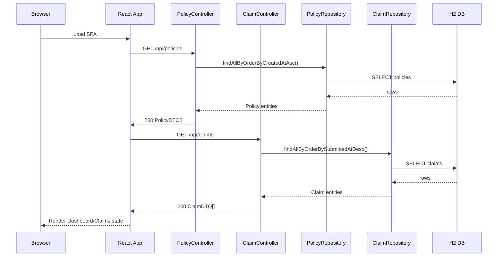
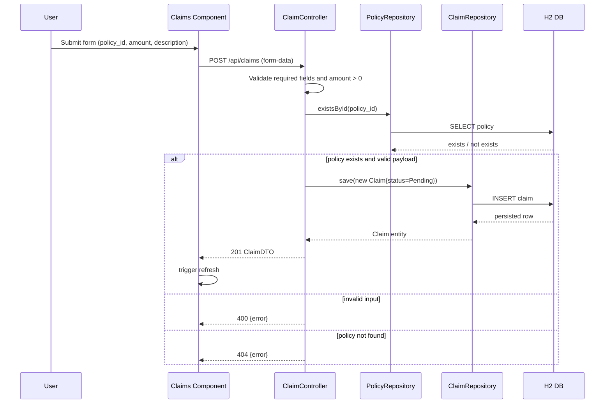
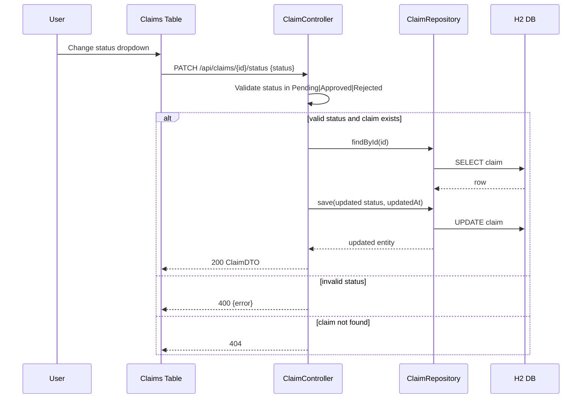

# InsureWell High-Level Design

## 1. Purpose and Scope
This document defines the implementation-aligned high-level design for InsureWell based on:
- docs/BRD.md
- docs/Epics.md
- docs/Features.md
- Current React + Spring Boot codebase in src/frontend and src/backend

Primary focus in this revision:
- Component architecture and boundaries
- End-to-end data flow between React frontend and Spring Boot REST API
- JPA persistence layer design
- Claims submission and claims status update API surface

## 2. Architecture Summary
InsureWell is a modular monolith with a browser-based React client and a Spring Boot backend exposing REST APIs over /api. The backend uses Spring Data JPA with H2 in-memory storage for local development.

### 2.1 Component Diagram
```mermaid
flowchart LR
  U[User Browser] --> R[React SPA\nNavigation, Dashboard, Claims]

  R -->|GET /api/policies\nGET /api/claims| C1[PolicyController]
  R -->|POST /api/claims| C2[ClaimController]
  R -->|PATCH /api/claims/{id}/status| C2
  R -->|PATCH /api/policies/{id}\nDELETE /api/policies/{id}| C1

  C1 --> S1[Policy Service Logic\n(validation + DTO mapping)]
  C2 --> S2[Claim Service Logic\n(validation + state update)]

  S1 --> P1[PolicyRepository\nJpaRepository Policy,String]
  S2 --> P2[ClaimRepository\nJpaRepository Claim,String]

  P1 --> DB[(H2 DB\npolicies)]
  P2 --> DB[(H2 DB\nclaims)]

  CFG[DataConfig Seed Loader] --> P1
  CFG --> P2
```

## 3. Module Boundaries and Responsibilities

### 3.1 Frontend Module (React)
Responsibilities:
- Render policy and claims experiences (Dashboard, Claims, Navigation)
- Orchestrate API calls via axios from App-level refresh flow
- Client-side filtering for claims by selected policy

Key implementation anchors:
- src/frontend/src/App.js
- src/frontend/src/components/Dashboard.js
- src/frontend/src/components/Claims.js

### 3.2 API Module (Spring Boot REST Controllers)
Responsibilities:
- Expose resource-oriented endpoints for policies and claims
- Validate request inputs and return status-aligned responses
- Map entities to DTO responses

Key implementation anchors:
- src/backend/src/main/java/com/insurewell/controller/PolicyController.java
- src/backend/src/main/java/com/insurewell/controller/ClaimController.java
- src/backend/src/main/java/com/insurewell/controller/ApiController.java

### 3.3 Persistence Module (JPA)
Responsibilities:
- Persist and query Policy and Claim entities
- Support list ordering and policy-scoped claim retrieval
- Enforce basic NOT NULL and PK constraints through entity metadata

Key implementation anchors:
- src/backend/src/main/java/com/insurewell/model/Policy.java
- src/backend/src/main/java/com/insurewell/model/Claim.java
- src/backend/src/main/java/com/insurewell/repository/PolicyRepository.java
- src/backend/src/main/java/com/insurewell/repository/ClaimRepository.java

### 3.4 Data Bootstrap Module
Responsibilities:
- Seed baseline records for local demo flows
- Ensure dashboard/claims screens have starter data at boot

Key implementation anchor:
- src/backend/src/main/java/com/insurewell/config/DataConfig.java

## 4. Data Flow Design

### 4.1 Initial Dashboard Load


### 4.2 Claims Submission Flow (POST)


### 4.3 Claims Status Update Flow (PATCH)


## 5. Claims Submission and Update API Surface

### 5.1 Submit Claim
Endpoint:
- POST /api/claims

Request content type:
- multipart/form-data

Required request fields:
- policy_id: string
- amount: number (must be > 0)
- description: string (non-empty)

Success response:
- Status: 201 Created
- Body: ClaimDTO

Error responses:
- 400 Bad Request: missing/invalid policy_id, amount, description
- 404 Not Found: policy_id does not exist

Current implementation note:
- file_name is always null in current createClaim implementation (actual binary upload handling is not active yet).

### 5.2 Update Claim Status
Endpoint:
- PATCH /api/claims/{id}/status

Request content type:
- application/json

Request body:
- status: one of Pending, Approved, Rejected

Success response:
- Status: 200 OK
- Body: updated ClaimDTO

Error responses:
- 400 Bad Request: status outside allowed set
- 404 Not Found: claim id does not exist

### 5.3 Related Claims Endpoints
- GET /api/claims?policy_id={id} -> list all claims or policy-scoped claims
- DELETE /api/claims/{id} -> delete claim (204 on success)
- GET /api/claims/health -> health probe for claims API

## 6. JPA Persistence Layer Design

### 6.1 Entities
Policy entity:
- Mapped to table policies
- Primary key: id (String)
- Fields: holderName, planName, coverageAmount, status, startDate, endDate, createdAt

Claim entity:
- Mapped to table claims
- Primary key: id (String)
- Fields: policyId, amount, description, status, fileName, submittedAt, updatedAt

### 6.2 Repository Contracts
PolicyRepository:
- findAllByOrderByCreatedAtAsc()

ClaimRepository:
- findByPolicyIdOrderBySubmittedAtDesc(String policyId)
- findAllByOrderBySubmittedAtDesc()

### 6.3 Integrity and Constraint Expectations
Current:
- PK + NOT NULL via JPA annotations
- App-layer checks for amount/status validity
- Existence check on policy before claim insert

Planned hardening:
- Add explicit FK and CHECK constraints through migration scripts
- Add indexes for claim filtering and timeline reads

## 7. Validation, Error Handling, and Observability

Validation:
- Claim submit enforces required fields and positive amount
- Claim status update enforces strict status domain
- Policy create enforces holderName, planName, coverageAmount > 0

Error handling:
- Primarily controller-level early validation responses
- Mixture of JSON error payloads and empty 400/404 in some endpoints
- Design recommendation: unify to a standard error envelope across all controllers

Observability:
- Current: default Spring logs and frontend console errors
- Target baseline:
  - structured request logs (method, path, status, latency)
  - correlation id propagation
  - metrics for claims create/update success and failure rates

## 8. Test Strategy for Critical Flows

Critical flows to cover:
- F4 claim submit happy path and negative path
- claim status update valid transitions and invalid state rejection
- policy CRUD with downstream impact on claims visibility
- policy filter behavior in claims list

Recommended test layers:
- Backend integration tests for REST contracts and status codes
- Repository tests for sorted retrieval behavior
- Frontend component/integration tests for form validation and refresh flow
- Playwright E2E for submit claim and status update workflow

## 9. Design Decisions and Unresolved Questions

Design decisions:
1. Keep SPA + monolithic REST backend for MVP velocity and clarity.
2. Keep JPA repositories as the persistence seam for future DB migration.
3. Keep API-first DTO contracts to decouple UI rendering from entity internals.
4. Keep status update as explicit PATCH action to preserve workflow intent.

Unresolved questions:
1. Should claim status updates enforce transition rules (for example, disallow Approved -> Pending)?
2. Should claim attachments be implemented as binary storage with metadata table and secure download endpoint?
3. Should policy deletion remain hard delete, or move to soft delete with retention policy?
4. Should all API errors adopt a global exception handler contract before adding auth/roles?

## 10. Traceability Matrix (Feature -> HLD Module -> Data Entity)

| Feature | HLD Module | Data Entity |
|---|---|---|
| F4 Claim submission with supporting document upload | Frontend Module + API Module + Persistence Module | claims, policies |
| F5 Claim details view with timeline and status explanation | Frontend Module + API Module | claims |
| F6 Claim review queue with notes and disposition actions | Frontend Module + API Module | claims |
| F10 Search/filter/sort/pagination for claims | Frontend Module + Persistence Module | claims |
| F3 Audit trail for policy and claim changes (future extension) | API Module + Persistence Module | claims, policies, audit_events (planned) |

## 11. Cloud Delegation Candidates
1. Task: Standardize API error envelope and global exception handling.
   Files: src/backend/src/main/java/com/insurewell/controller/*.java, src/backend/src/main/java/com/insurewell/config/
   Effort: M
   Risk: Medium
   Acceptance criteria: all 4xx/5xx responses follow one JSON schema with code/message/details.

2. Task: Add claims contract tests for POST and PATCH status endpoints.
   Files: src/backend/src/test/java/com/insurewell/
   Effort: S
   Risk: Low
   Acceptance criteria: tests verify 201/200 happy paths and 400/404 negative paths.

3. Task: Implement claim status transition guard rules.
   Files: src/backend/src/main/java/com/insurewell/controller/ClaimController.java
   Effort: S
   Risk: Medium
   Acceptance criteria: invalid transitions return 409 with domain-specific error.

4. Task: Add DB migration baseline with indexes and checks.
   Files: src/backend/pom.xml, src/backend/src/main/resources/
   Effort: M
   Risk: Medium
   Acceptance criteria: migration tool enabled, schema version tracked, indexes/checks applied in local run.

5. Task: Add API observability interceptors and request correlation id.
   Files: src/backend/src/main/java/com/insurewell/config/
   Effort: M
   Risk: Medium
   Acceptance criteria: request logs include correlation id, latency, route, status.

## 12. Recommended Next Agent
3.SDLC Architecture Agent
