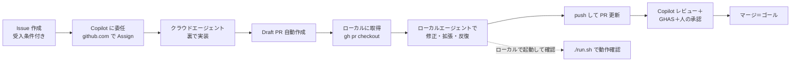
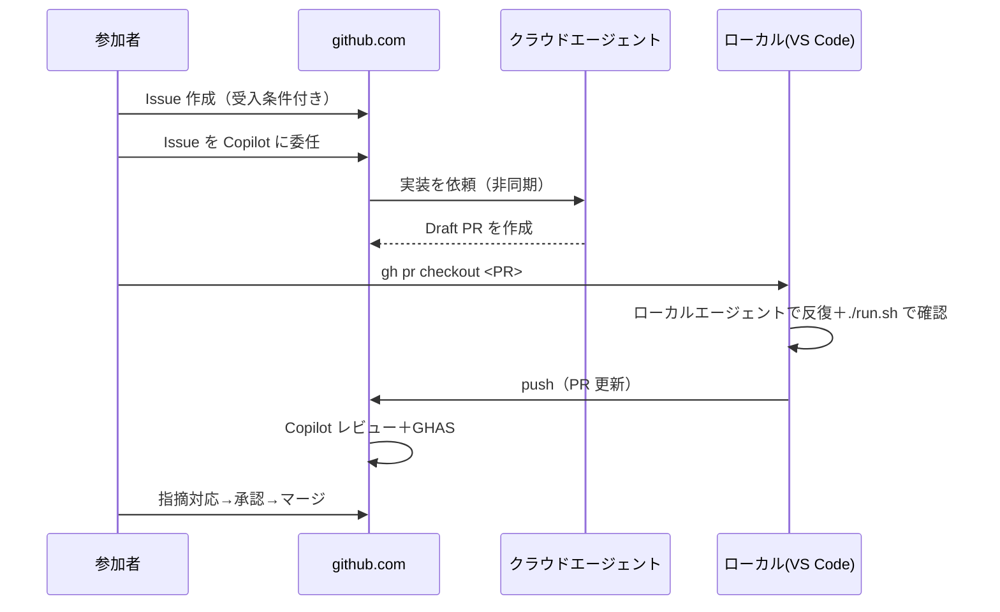

# エージェント導線と「完了（Definition of Done）」

> **これは何?** 「Issue をクラウドエージェントに委任した後、ローカルにどう戻して、どこまでやれば
> ゴールなのか」を一本の導線として整理します。当日いちばん迷うポイントです。
> **委任モードの基礎:** [4.Copilot-Agent-Delegation-Guide.md](4.Copilot-Agent-Delegation-Guide.md) ・ **デモ手順:** [5.Demo-Flow.md](5.Demo-Flow.md)

---

## 1. 全体像（1枚で）



**役割の境界:**
- **クラウド（非同期）** … Issue から**最初の実装をまるごと**作らせる（PR ができる）。待ち時間がある。
- **ローカル（対話）** … できた PR を**手元で動かし、足りない所を詰める**。即時・対話的。

---

## 2. ステップ詳細

### Step 1. Issue を用意する
- タイトル・説明・**受入条件（AC）**・ラベルを付ける。良い Issue = 良い実装。
- 文面とスクリプト: [../../docs/seed-issues.md](../../docs/seed-issues.md) / [../../scripts/create-seed-issues.sh](../../scripts/create-seed-issues.sh)

### Step 2. クラウドエージェントへ委任（github.com）
- Issue を開き、**Assignees に Copilot** を指定（または「Copilot に作業させる」）。
- これは **github.com 側の操作**で、ローカル MCP は不要。
- ⏱ **昼休み前に着手**しておくと、休憩中に非同期で実装が進む。

### Step 3. Draft PR ができる
- クラウドエージェントがブランチを作り、実装して **Draft PR** を起票。
- PR の説明・差分・チェック結果をまず**読む**（鵜呑みにしない）。

### Step 4. ローカルに取得する（ここが「戻し方」）
```bash
# PR 番号で取得（gh CLI）
gh pr checkout <PR番号>

# もしくはブランチ名で
git fetch origin
git switch <feature-branch>
```
> これで**クラウドが書いたコードが手元のブランチ**になります。以降はローカルエージェントの出番。

### Step 5. ローカルエージェントで反復
- VS Code を Agent モードにし、**不足の補完・バグ修正・テスト追加**を対話的に依頼。
- 例: 「このログイン機能、ログアウト導線が無いので React 側に追加して」。
- ローカルで起動して確認:
```bash
cd src && ./run.sh      # 3000/8080 で動作確認（Codespaces も同様）
```

### Step 6. push して PR を更新
```bash
git add -A && git commit -m "Refine auth flow"
git push            # 同じブランチに push すると PR が自動更新
```

### Step 7. レビュー → マージ（＝ゴール）
- PR で **Copilot レビュー**を実行、**GHAS** の指摘を確認（[11.GHAS-Pipeline.ja.md](11.GHAS-Pipeline.ja.md)）。
- 指摘に対応（`@copilot` で batch fix / commit suggestion も可）。
- **人が承認 → マージ**。ここが当日の到達点。

---

## 3. シーケンス（誰が・どこで・何を）



---

## 4. 「完了」の定義（Definition of Done）

> **大前提: 全フェーズ完走は必須ではありません。** 「型」を体感するのが目的。下表は“どこまでで一区切りか”の目安。

| フェーズ | これができたら完了 |
| --- | --- |
| Issue | タイトル/説明/**受入条件**/ラベルが揃い、Copilot に委任できた |
| クラウド委任 | Draft PR が作成された（中身は後で直す前提でOK）|
| ローカル取得 | `gh pr checkout` でブランチが手元に来た |
| ローカル反復 | `./run.sh` で**起動**し、対象機能の主要動作が確認できた |
| レビュー | Copilot レビュー＋GHAS の指摘を**確認**し、対応 or 課題として記録した |
| マージ | 人が承認し、`main` にマージできた（**当日の最終ゴール**）|

**最小ゴール（時間が無い人向け）:** 「Issue→委任→Draft PR まで」。残りは参照ブランチ
（[../Instructor-Runbook.ja.md](../Instructor-Runbook.ja.md) §3）でレビュー以降を体験できる。

---

## 5. よくある迷い

| 迷い | 答え |
| --- | --- |
| 委任した後、何を待てばいい? | Draft PR ができるまで（数分〜数十分）。待つ間に別フェーズや昼休みへ |
| ローカルにどう戻す? | `gh pr checkout <PR番号>`（§Step4）|
| クラウドとローカル、どっちで直す? | まるごと生成=クラウド / 手元で詰める・デバッグ=ローカル |
| どこがゴール? | **承認してマージ**（最小ゴールは Draft PR まで）|
| PR が壊れていて進めない | 参照ブランチに乗り換えてレビュー以降を体験（止めない）|

---

## 参考
- 委任モードの基礎: [4.Copilot-Agent-Delegation-Guide.md](4.Copilot-Agent-Delegation-Guide.md)
- デモ手順: [5.Demo-Flow.md](5.Demo-Flow.md)
- GHAS パイプライン: [11.GHAS-Pipeline.ja.md](11.GHAS-Pipeline.ja.md)
- QA 戦略: [12.QA-Strategy.ja.md](12.QA-Strategy.ja.md)
