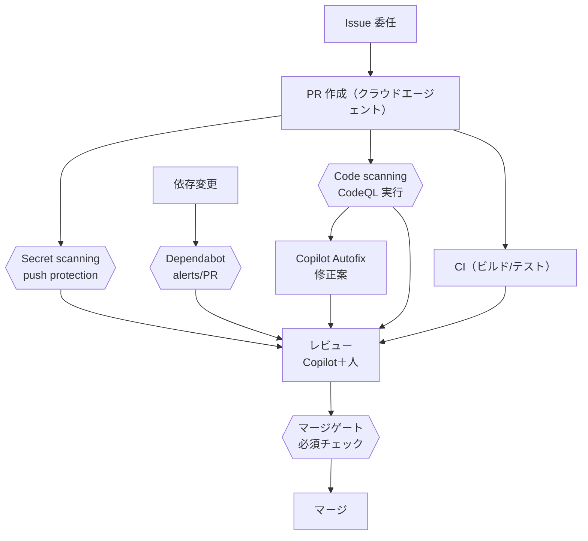
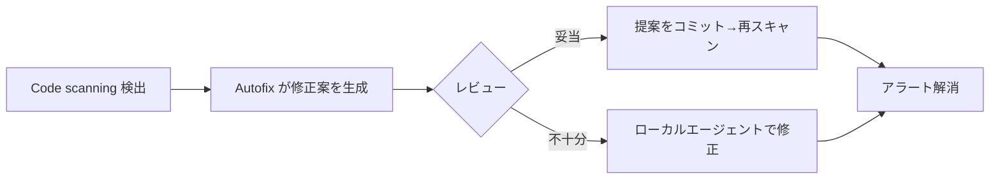

# GHAS をパイプラインのどこに入れるか

> **これは何?** GHAS（GitHub Advanced Security）の各機能が、**Issue→PR→CI→レビュー→マージ**の
> どこで・何を・どう動くのかを分解します。「使い方が難しい／導線が分かりにくい」を解消する目的です。
> **有効化（管理者）:** [../setup/0.Organizer-Preflight.ja.md](../setup/0.Organizer-Preflight.ja.md) §B ・ **エージェント導線:** [10.Agent-Flow-and-DoD.ja.md](10.Agent-Flow-and-DoD.ja.md)

---

## 1. GHAS の3本柱（まず役割を分ける）

| 機能 | 何を見るか | いつ動くか |
| --- | --- | --- |
| **Code scanning（CodeQL）** | コードの脆弱性（SQLi/XSS/認可漏れ等）| PR / push / スケジュール |
| **Secret scanning** | トークン・鍵などの**秘密情報の混入** | push 時（push protection で**事前ブロック**も）|
| **Dependabot** | **依存ライブラリ**の既知脆弱性・更新 | 依存変更/スケジュール |

> 補足: **Copilot Autofix** は Code scanning の指摘に対して**修正案を提示**する機能（後述）。

---

## 2. パイプラインのどこで動くか（チェックポイント図）

**読み方:**
- **PR を作った瞬間**に Secret scanning / Code scanning / CI が走る（チェックポイント `{{ }}`）。
- 指摘は **Security タブ**と **PR の Checks/Conversation** の両方に出る。
- **マージゲート**（必須ステータスチェック）で「未解決の重大指摘はマージさせない」運用ができる。

---

## 3. 当日の進め方（ステップ）

### Step 1. 有効になっているか確認
- リポジトリ **Settings → Code security** で Code scanning / Secret scanning / Dependabot が ON。
- 未設定なら主催者が事前有効化（[../setup/0.Organizer-Preflight.ja.md](../setup/0.Organizer-Preflight.ja.md) §B）。

### Step 2. PR を作って Code scanning を走らせる
- クラウドエージェントの PR、または参照 PR を使う。
- **Checks** タブに「CodeQL」が出て、完了するとアラートが付く。

### Step 3. アラートをトリアージ（Security タブ）
- **Security → Code scanning alerts** を開く。各アラートで:
  - **どの行・どの経路**が問題か（データフロー）
  - 重大度（critical/high/…）
  - **Copilot Autofix** の修正案（あれば「Generate fix」/ 提案コミット）
- 対応方針を決める: **修正** / **誤検知として dismiss（理由付き）** / **課題化**。

### Step 4. Secret scanning を確認
- **Security → Secret scanning alerts**。検出された秘密は**無効化（rotate）**が原則。
- push protection が有効なら、そもそも push 時にブロックされる体験を見せる。

### Step 5. Dependabot を確認
- **Security → Dependabot alerts**、必要なら **Dependabot security updates** の PR を確認。
- 設定は [`.github/dependabot.yml`](../../.github/dependabot.yml)。

### Step 6. マージゲート
- 重大アラート未解決ならマージしない運用（必須チェック）を見せる。
- ※当日詰まらないよう、**厳格な必須化はデモ用に留め**、バイパス手順も用意。

---

## 4. Copilot Autofix の使いどころ

- まず Autofix の案を見る → 妥当ならコミット、足りなければ**ローカルエージェント**で仕上げる。
- 「AI が見つけ、AI が直し、人が承認する」の流れを体感するのが狙い。

---

## 5. 人 vs AI の分担（GHAS 編）

| 作業 | 主担当 |
| --- | --- |
| 脆弱性の検出 | **GHAS（自動）** |
| 修正案の生成 | **Copilot Autofix / ローカルエージェント** |
| 誤検知判断・重大度の最終判断 | **人** |
| dismiss 理由の記録・例外運用 | **人** |
| 秘密情報の rotate | **人**（手順は組織ポリシー）|

---

## 6. 「完了」の目安（DoD）

| 項目 | 完了 |
| --- | --- |
| Code scanning | アラートを**確認**し、修正 or 理由付き dismiss or 課題化した |
| Secret scanning | 検出ゼロ、または検出分の対応方針を決めた |
| Dependabot | alerts を確認し、重大分の対応方針を決めた |
| 体験ゴール | 「検出→修正案→承認」の一連を一度通した |

---

## 参考
- 管理者の有効化手順: [../setup/0.Organizer-Preflight.ja.md](../setup/0.Organizer-Preflight.ja.md)
- エージェント導線とゴール: [10.Agent-Flow-and-DoD.ja.md](10.Agent-Flow-and-DoD.ja.md)
- Dependabot 設定: [`.github/dependabot.yml`](../../.github/dependabot.yml)

---

**← 前: [デモフロー](5.Demo-Flow.ja.md)** ｜ **[目次: Workshop-Guide.ja.md](../Workshop-Guide.ja.md)** ｜ **次: [QA 戦略](12.QA-Strategy.ja.md) →**
