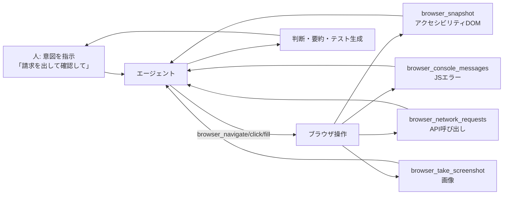
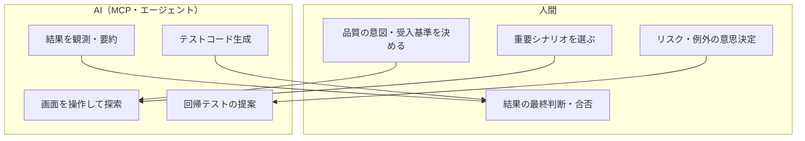
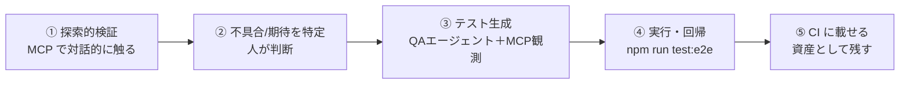

# QA 戦略 — Playwright × MCP × 人間/AI の分担

> **これは何?** 「Playwright をどう使って品質を担保するか」「**MCP を使うことで何ができるようになるのか**」
> 「人の操作・結果をどうエージェントに渡すのか」「どこまで人・どこから AI か」を整理し、QA フェーズの
> **ゴール**を明確にします。
> **MCP セットアップ:** [6.playwright-mcp-setup-working.md](6.playwright-mcp-setup-working.md) ・ **MCPなしの代替:** [../setup/4.MCP-Fallback.ja.md](../setup/4.MCP-Fallback.ja.md)

---

## 1. まず用語を分ける: 「Playwright」と「Playwright MCP」

| | Playwright（本体）| Playwright **MCP** |
| --- | --- | --- |
| 形態 | テストフレームワーク（`*.spec.ts` を**書いて**実行）| Copilot から呼べる**ブラウザ操作ツール群**（`browser_*`）|
| 使い方 | コードを書く → `npm run test:e2e` | **自然言語で指示** → エージェントがブラウザを操作 |
| 強み | 反復実行・CI・回帰検出（**資産として残る**）| 探索的・対話的・**コード無しで今すぐ検証** |
| 成果物 | テストコード | 操作ログ・スナップショット・スクショ（会話内）|

> **MCP で“新しくできること”** = 「テストコードを書く前に、**エージェントが実際に画面を触って**
> 確認し、**その結果（DOM スナップショット/コンソール/ネットワーク/スクショ）を文脈として持った上で**、
> 必要なテストコードまで生成する」こと。Playwright 本体だけだと「まずコードを書く」必要がありました。

---

## 2. 人の操作・結果は、どうエージェントに渡るのか

MCP のブラウザツールは、操作の**結果を構造化データとして返す**ため、それがそのまま
エージェントの文脈になります。人が「何を確認したいか」を渡し、AI が「触って・観測して・判断」します。

| 渡るもの | 取得ツール | エージェントが使う用途 |
| --- | --- | --- |
| 画面の構造（要素・テキスト）| `browser_snapshot` | 期待要素の有無・状態の検証 |
| コンソールのエラー | `browser_console_messages` | 例外・警告の検出 |
| ネットワーク（API）| `browser_network_requests` | 正しい API が叩かれたか／ステータス |
| 画面の画像 | `browser_take_screenshot` | 目視確認・レポート添付 |

> ポイント: **人は「結果」を逐一コピペしなくてよい。** 操作の観測結果が自動でエージェントに渡るため、
> 人は**意図（何を確かめたいか）と最終判断**に集中できます。

---

## 3. 人 vs AI の分担（QA 編）

| 観点 | 人がやるべき | AI に任せてよい |
| --- | --- | --- |
| 何を品質とするか（受入基準）| ✅ | |
| どのシナリオが重要か | ✅（選定）| 補助提案 |
| 実際の画面操作・観測 | | ✅（MCP）|
| 結果の要約・異常の指摘 | | ✅ |
| 合否の最終判断 | ✅ | |
| テストコードの作成 | レビュー | ✅（生成）|
| 回帰テストの維持 | 方針 | ✅（追加提案）|

---

## 4. 推奨フロー（探索 → 確定 → 資産化）

1. **探索（MCP）**: `@6.SDLC Test Agent` や Playwright MCP で画面を触り、期待どおりか確認。
   - 例: 「Claims で 1500 円の請求を出し、一覧に出るか、API は 200 か確認して」
2. **判断（人）**: 何が正しい挙動か、どこを自動化すべきかを決める。
3. **テスト生成（AI＋観測）**: 観測結果を踏まえて `*.spec.ts` を生成（`data-testid` を使用）。
4. **実行・回帰**: `npm run test:e2e`（[6.playwright-mcp-setup-working.md](6.playwright-mcp-setup-working.md) §9）。
5. **資産化**: CI に載せ、回帰検出できるようにする。

> セレクタは必ず **`data-testid`** を使用（[6 ガイド](6.playwright-mcp-setup-working.md) §8）。UI を日本語化しても
> `data-testid` は不変なので、テストは壊れません。

---

## 5. このフェーズのゴール（明確化）

> **ゴール = 「人が品質の意図と合否を持ち、AI が操作・観測・テスト生成を担う」体制を一度通すこと。**

- ✅ MCP で**コードを書く前に**画面を触って確認できた
- ✅ 操作の**結果（DOM/コンソール/ネットワーク/スクショ）**がエージェントに渡ることを体験した
- ✅ 観測を踏まえて**テストを生成**し、`npm run test:e2e` で**実行**できた
- ✅ **人=判断 / AI=操作・生成**の境界を言語化できた

最小ゴール: 「MCP で 1 シナリオ触って確認 →（任意で）テスト 1 本生成」。

---

## 6. MCP が不調なとき

- Playwright MCP が動かない場合は **`npm run test:e2e`（本体）** で代替（[../setup/4.MCP-Fallback.ja.md](../setup/4.MCP-Fallback.ja.md) §4）。
- ブラウザ未導入なら `npx playwright install chromium`。

---

## 参考
- MCP セットアップ/演習: [6.playwright-mcp-setup-working.md](6.playwright-mcp-setup-working.md)
- MCP なしの代替: [../setup/4.MCP-Fallback.ja.md](../setup/4.MCP-Fallback.ja.md)
- エージェント導線とゴール: [10.Agent-Flow-and-DoD.ja.md](10.Agent-Flow-and-DoD.ja.md)
