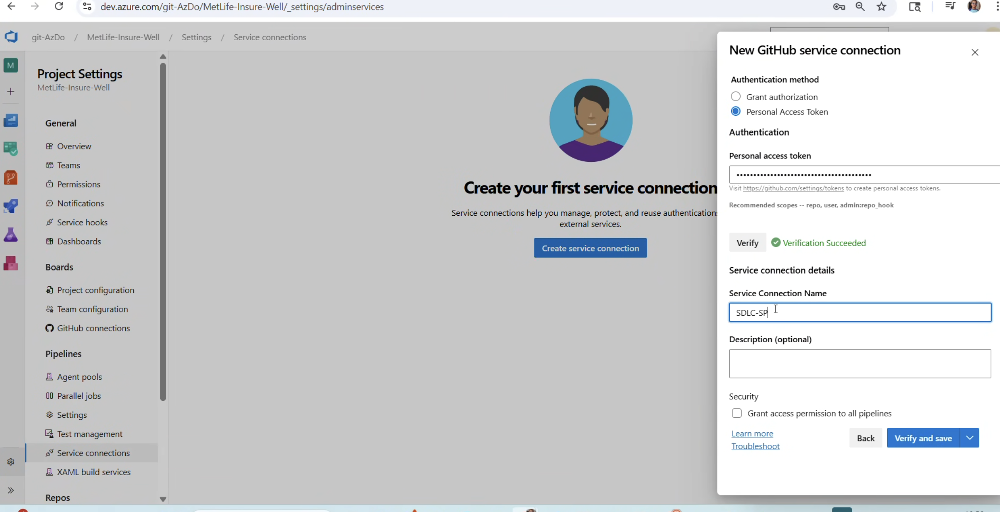

# 🚀 エージェント駆動 SDLC ワークフローの流れ

## ステップごとのビジュアルガイド

### 1️⃣ リクエストフローのセットアップ

Issue からワークフローのリクエストを開始 → エージェントが処理 → コード生成

### 2️⃣ サービス接続

GHE と Azure DevOps の間にパイプライン連携用のセキュアな接続を確立

### 3️⃣ Copilot コードレビュー(初回)

生成されたコードに対し Copilot が自動コードレビューを開始

### 4️⃣ ステータスチェック

CI/CD パイプラインが自動チェックとバリデーションを実行

### 5️⃣ 自動コードレビュー

詳細なフィードバックを伴うフルの自動コードレビュー

### 6️⃣ GitHub アカウントと ADO を連携

GitHub と Azure DevOps の認証およびアカウント連携

### 7️⃣ ドラフト Pull Request

PR をドラフト状態で作成、レビュー準備完了

### 8️⃣ レビュー準備完了

PR を人間のレビュー・承認用に Ready 状態へ

### 9️⃣ Copilot で一括修正

検出された問題に対し Copilot がまとめて修正を生成

### 🔟 コミット提案

Copilot がコミットメッセージと変更内容を提案

### 1️⃣1️⃣ @copilot へ委任

開発者がタスクを委任: `@copilot apply fixes`

### 1️⃣2️⃣ 修正してコミット

Copilot が自動で修正を適用しコミット

### 1️⃣3️⃣ @copilot 実行中

Copilot が要求された全変更を処理・最終化

---

## 🎯 主な成果

✅ Issue から PR までの自動ワークフロー  
✅ 継続的なコードレビューフィードバック  
✅ Copilot 委任による自己修復能力  
✅ Azure DevOps パイプラインとのシームレスな統合  
✅ 手動レビューサイクルの削減
